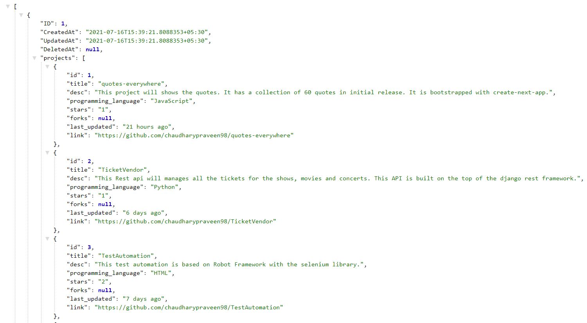

[](https://pkg.go.dev/github.com/chaudharypraveen98/GoProfileAPI)

  

##  Go Profile Rest API

This projects provide Rest API built on the top of the Gorm and Fiber using Golang.

It uses the json library for parsing the data from file and with the help of gorm it intialize the database.

### Topics -> go, gorm, fiber, webdevelopment, api

##### Preview Link -> <u><a href="https://drive.google.com/file/d/1gh09T8UOu3S6JHCmrlvg36oqsSvx-XrM/preview">RpaChallenge</a></u>

##### Source Code Link -> <u><a href="https://github.com/chaudharypraveen98/GoProfileAPI">GitHub</a></u>

##### Web Preview


**What We are going to do?**
<ol>
        <li>Creating a struct for projects</li>
        <li>Fetching File from the JSON file</li>
        <li>Managing Database</li>
        <li>Making Api handlers</li>
        <li>Creating API route</li>
        <li>Running our App</li>
</ol>
### Understanding Some Important Concepts
**What is Fiber and Gorm?**
<b>Fiber</b>
Fiber is an Express inspired web framework built on top of Fasthttp, the fastest HTTP engine for Go. Designed to ease things up for fast development with zero memory allocation and performance in mind.
<b>Gorm</b>
The GORM is fantastic ORM library for Golang, aims to be developer friendly. It is an ORM library for dealing with relational databases. This gorm library is developed on the top of database/sql package.
<b>Top Features of Fiber Framework</b>
<ul>
        <li>Routing</li>
        <li>Middleware Support</li>
        <li>Low on memory footprint</li>
        <li>Highly performant</li>
</ul>

## Step 1 => Creating a struct for projects
We will create the struct for projects and their types.

```
package projects

import (
"errors"
"fmt"

"github.com/chaudharypraveen98/GoProfileAPI/database"
"github.com/gofiber/fiber/v2"
"gorm.io/datatypes"
"gorm.io/gorm"
)

type Projects struct {
gorm.Model
Projects datatypes.JSON `json:"projects" gorm:"foreignKey:ID"`
}

// all projects serializer
type SerialProject struct {
Projects []SingleProject `json:"projects" gorm:"foreignKey:ID"`
}

type SingleProject struct {
gorm.Model
ID                  int32  `gorm:"primaryKey;autoIncrement:True;" json:"id"`
Title               string `json:"title"`
Desciption          string `json:"desc"`
ProgrammingLanguage string `json:"programming_language"`
Stars               int32  `gorm:"default:null" json:"stars"`
Forks               int32  `gorm:"default:null" json:"forks"`
LastUpdated         string `json:"last_updated"`
Link                string `json:"link"`
}
.....
...
```

## Step 2 => Fetching File from the JSON file

We will fetch data from the json file

```
func loadData() {
....

// Open our jsonFile
jsonFile, err := os.Open("data/projects.json")

....
}
```

## Step 3 => Managing Database

We will first create a database then save the data into it. We can perform Crud operation
<b>Initializing the database</b>
It will make a connection between the database and our program.

```
func initDatabase() {
var err error
database.DBConn, err = gorm.Open(sqlite.Open("projects.db"), &gorm.Config{})
if err != nil {
        panic("Failed to connect to database")
}
fmt.Println("Database successfully opened")
}
```

<b>Loading the data into the database</b>
It will first check the table. If, it exists then it will first drop it then recreate a new one.
```
func loadData() {
        // initiate the database connection
        db := database.DBConn

        // Open our jsonFile
        jsonFile, err := os.Open("data/projects.json")

        // if we os.Open returns an error then handle while opening
        if err != nil {
        panic(err)
        }
        fmt.Println("Successfully Opened Projects.json")
        byteValue, _ := ioutil.ReadAll(jsonFile)
        var SerialProjectData projects.SerialProject
        json.Unmarshal(byteValue, &SerialProjectData)

        // delete tables if they exit already
        db.Migrator().DropTable(&projects.Projects{})
        db.Migrator().DropTable(&projects.SingleProject{})

        // create table using struct
        db.Migrator().CreateTable(&projects.Projects{})
        db.Migrator().CreateTable(&projects.SingleProject{})

        var allProjects projects.Projects
        json.Unmarshal(byteValue, &allProjects)

        // creating collections of all projects
        db.Create(&allProjects)

        // creating single project
        for _, project := range SerialProjectData.Projects {
                var singleProject projects.SingleProject
                singleProject.ID = project.ID
                singleProject.Title = project.Title
                singleProject.Desciption = project.Desciption
                singleProject.Forks = project.Forks
                singleProject.LastUpdated = project.LastUpdated
                singleProject.Link = project.Link
                singleProject.ProgrammingLanguage = project.ProgrammingLanguage
                db.Create(&singleProject)
        }
        defer jsonFile.Close()
}
```

## Step 4 => Making Api handlers  
We will make the CRUD (Create Read Update and Delete) operation.

**Get all the Projects**
This function will provide all the projects on get request.

```
func GetProjects(c *fiber.Ctx) error {
        db := database.DBConn
        var projects []Projects
        err := db.Find(&projects).Error
        if errors.Is(err, gorm.ErrRecordNotFound) {
        return c.SendStatus(404)
        }
        return c.JSON(projects)
}
```

**Get Single Prpject**
We can get a single project using the project id.

```
func GetSingleProject(c *fiber.Ctx) error {
        db := database.DBConn
        id := c.Params("id")
        var SingleProject SingleProject
        err := db.First(&SingleProject, id).Error
        if errors.Is(err, gorm.ErrRecordNotFound) {
                return c.SendStatus(404)
        }
        return c.JSON(SingleProject)
}
```

**Create a Project**
This function will create a new project on Post request.

```
// It will create a project with incremented id.
func CreateSingleProject(c *fiber.Ctx) error {
db := database.DBConn
inputData := SingleProject{}
if err := c.BodyParser(&inputData); err != nil {
fmt.Println("error = ", err)
return c.SendStatus(500)
}
lastProject := SingleProject{}
db.Last(&lastProject)
inputData.ID = lastProject.ID + 1
db.Create(&inputData)
return c.SendStatus(201)
}
```

**Update a project**
It will update the previous project.
```
func UpdateSingleProject(c *fiber.Ctx) error {
        db := database.DBConn
        id := c.Params("id")
        var SingleProject SingleProject
        db.First(&SingleProject, id)
        inputData := SingleProject
        if err := c.BodyParser(&inputData); err != nil {
                fmt.Println("error = ", err)
                return c.SendStatus(200)
        }
        fmt.Println("--------")
        fmt.Println(inputData)
        db.Save(inputData)
        return c.SendStatus(204)
}
```

**Delete a Project**
Delete a previous project with a given id

```
func DeleteProject(c *fiber.Ctx) error {
        db := database.DBConn
        id := c.Params("id")
        var SingleProject SingleProject
        err := db.Delete(&SingleProject, id).Error
        if errors.Is(err, gorm.ErrRecordNotFound) {
                return c.SendStatus(404)
        }
        return c.SendStatus(202)
        }
```

## Step 5 => Creating API route
We will make api routes which will call the respective function handlers.

```
// router to handles url endpoints
func setRoutes(app *fiber.App) {
        app.Get("/api/v1/projects", projects.GetProjects)
        app.Get("/api/v1/projects/:id", projects.GetSingleProject)
        app.Post("/api/v1/projects/:id/update", projects.UpdateSingleProject)
        app.Post("/api/v1/projects/create", projects.CreateSingleProject)
        app.Post("/api/v1/projects/:id/delete", projects.DeleteProject)
}
```

## Running our App
First we need to install the required libraries.

```
go get -u gorm.io/gorm
go get -u gorm.io/driver/sqlite
go get github.com/gofiber/fiber/v2
```

**Declaring the Main function**
It will manage all the functions.

```
func main() {
        app := fiber.New()
        initDatabase()
        loadData()
        database.DBConn.AutoMigrate(&projects.SingleProject{}, &projects.Projects{})
        fmt.Println("Database migrated successfully")
        fmt.Println("---------------------------")
        setRoutes(app)
        app.Listen(":3000")
}
```

<b>Running the project</b>

```
go run main.go
```

**API Endpoints : -**
<ol>
<li>Get <code>/api/v1/projects</code> --> Fetch all the projects</li>

<li>Get <code>/api/v1/projects/:id</code> --> Fetch a single project with id as a parameter</li>

<li>Post <code>/api/v1/projects/:id/update</code> --> Update the existing project with the help of id. Pass the body as a JSON.	
<ul>
        <li>Endpoint <code>http://127.0.0.1:3000/api/v1/projects/1/update</code></li>
        <li>JSON Body  <code>{"title":"admin"}</code></li>
</ul>
</li>

<li>Post <code>/api/v1/projects/create</code>
        <ul>
                <li>Endpoint <code>http://127.0.0.1:3000/api/v1/projects/create</code></li>
                <li>Example</li>
                <li>
                
```
{

"title": "praveen",

"desc": "This project will shows the quotes. It has a collection of 60 quotes in initial release. It is bootstrapped with create-next-app.",

"programming_language": "JavaScript",

"stars": 0,

"forks": 0,

"last_updated": "21 hours ago",

"link": "https://github.com/chaudharypraveen98/quotes-everywhere"

}
```
</li></ul></li>

<li>Post <code>/api/v1/projects/:id/delete</code>
<ul>
        <li>Endpoint <code>http://127.0.0.1:3000/api/v1/projects/1/delete</code></li>
        <li>It doesn't require json body</li>
</ul>
</li>
</ol>  

####  Features

1. Json response

2. Separate urls for all projects and single projects

3. Clean Code

4. Implements the CRUD functionality.

  

####  Note

Feel free to contribute and suggest changes. PR's are most welcomed.

#####  Last Update

19 April 2021